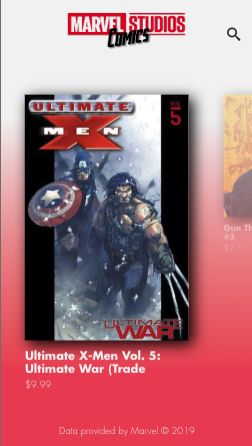
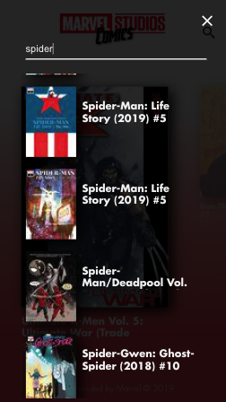
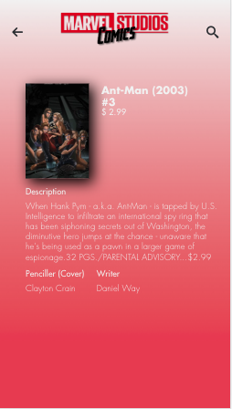
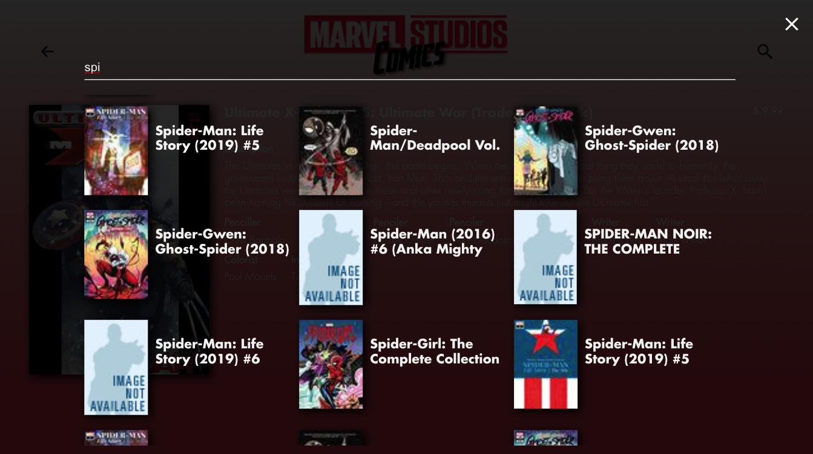
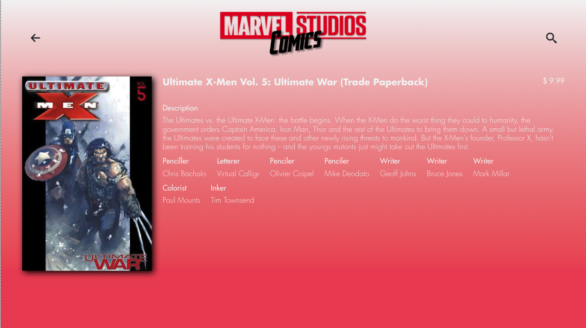

# React Marvel Comics Catalog


> Esto es un simple ejemplo de como usar la API de marvel con redux para mostrar el listado de comics


[](https://travis-ci.org/kappys1/react-marvel-comics)
[](https://standardjs.com)
[](https://github.com/semantic-release/semantic-release)

[Github Pages](https://kappys1.github.io/react-marvel-comics/)

[Heroku](https://react-marvel-comic.herokuapp.com/)

#### ❗ Importante ❗

La API de Marvel© limita a **3000 requests** por dia, si no funciona posiblemente es que se han acabado las peticiones diarias. Si deseas hacerlo funcionar en tu maquina, deberas cambiar [tus api keys](https://developer.marvel.com/documentation/getting_started) en las variables de entorno.
**_yo he dejado un archivo .env en la raiz donde podras cambiarlo, esta no es la mejor manera, pero esto es solo un ejemplo_**

```
REACT_APP_API_PUBLIC_KEY=
REACT_APP_API_PRIVATE_KEY=
```

## 🗒️ Requisitos

- [x] Listado
  - [x] Mostrar titulo
  - [x] Ordenar (Sidebar)
  - [x] Filtrar (Pagina de busqueda)
- [x] Detail Page

### Bonus

- [x] Mobile Support
- [ ] Testing (in Progress🔄)
- [x] User Interface
- [x] Performance
  - utilización de Suspense y Lazy en la carga inicial.

## 👨🏻‍💻Descripción del Proceso

### 👨🏻‍🎨 Diseño

Esta aplicación ha sido pensada diseñada pensando en el concepto **Mobile first** con [Sketch](https://github.com/kappys1/react-marvel-comics/tree/master/docs/sketch). Tiene como objetivo ser una SPA sin necesidad de utilización de React Router.
Se ha creado un Styleguide acorde con el diseño de Marvel (rojo y blanco).

Una vez terminado con Sketch, pase el diseño a [Zeplin](https://zeplin.io/) ya que gracias a esta herramienta es mucho mas facil a la hora de maquetar.

### ⌨️ Codificacion

Sabiendo que algunas cosas son mejorables, se ha intentado demostar la utilización de Redux y React Hooks, funcionalidad muy extendida en la comunidad react y otra bastante nueva.
A su vez se ha intentado mostrar buenas practicas a la hora de consumir la API mediante paginación y la preparación para su filtrado y ordenado entre otras.

### ⚒️ CI/CD

Se ha implementado un pipeline mediante travis en el que se ejecuta diferentes _stages_ como seria la realización de los test y build del proyecto para posteriormente hacer el deploy en github pages y heroku.

## Imagenes








